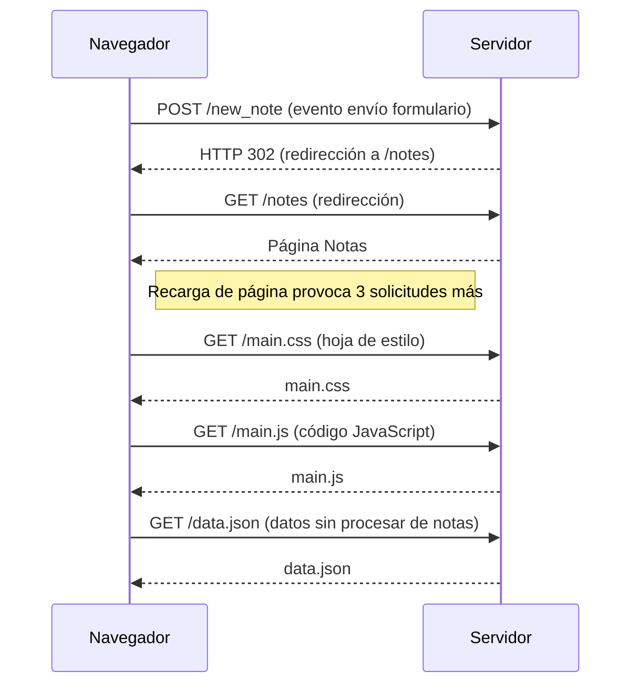

# Diagrama de Secuencia - Envío de formulario y solicitudes HTTP

Este diagrama muestra el flujo de interacción entre el navegador y el servidor cuando se envía un formulario que provoca múltiples solicitudes HTTP.

