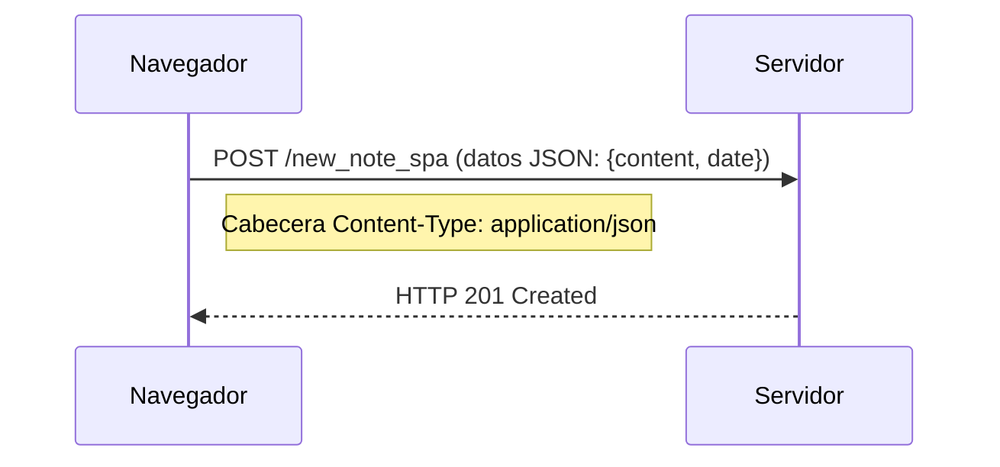

# Diagrama de Secuencia - Creación de nota en SPA

Este diagrama muestra la interacción entre el navegador y el servidor al crear una nueva nota en una aplicación de una sola página (SPA).

```mermaid
sequenceDiagram
Navegador->>Servidor: POST /new_note_spa (datos JSON: {content, date})
Note right of Navegador: Cabecera Content-Type: application/json
Servidor-->>Navegador: HTTP 201 Created
```
